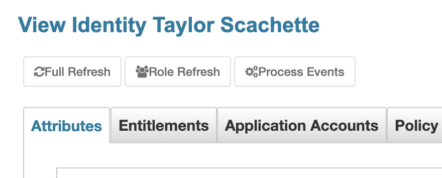
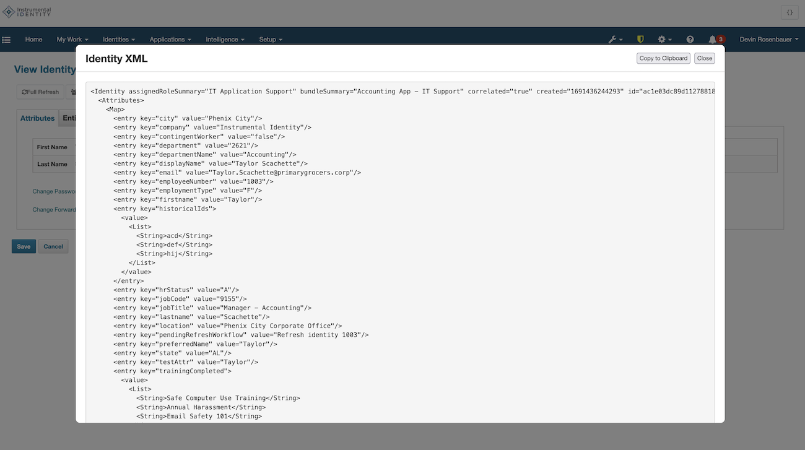

= Simple UI Plugin
:doctype: book

This repository contains the Simple UI Plugin demonstrated by Devin Rosenbauer at SailPoint's Developer Days 2026 conference. It provides a simple example of a user interface modification in SailPoint to make it more user-friendly.

The PowerPoint slide deck for Devin's presentation is available in the `docs` folder.

include::BUILDING.adoc[leveloffset=+1]

== Branches

The `main` branch contains the feature-complete plugin as demonstrated by the end of the Developer Days talk. This branch is intended to be used as a reference implementation for anyone looking to build their own UI plugin.

There are five additional branches in this repository, each beginning with `step` (e.g., `step/0/...`, `step/1/...`). These branches contain the code for each of the steps demonstrated during the presentation at Developer Days. (Step 0 was previously `main`, but was renamed to make it easier to follow along.)

== Steps

=== Step 1: Backend implementation

This branch includes a first pass at the backend of this plugin, including some automated JUnit tests to verify functionality. It is not yet a working example, because the front-end remains to be implemented in the next step.

=== Step 2: Front-end implementation

This branch includes a first pass at the front-end of this plugin. After this step, the plugin should be functional and ready for use as pictured here:

.Buttons injected onto the Identity Warehouse page by the plugin

However, the code could stand to be further cleaned up, which happens in the next step.

=== Step 3: Code cleanup

This branch includes some code cleanup and refactoring to make modification of the plugin easier. It also adds auditing, metering, and other observability features to make the plugin more production-ready.

=== Step 4: Additional bonus feature - XML popup

This branch includes an additional bonus feature that was not included in the original goals. When the user presses the backtick key while viewing an Identity in the Identity Warehouse, the XML representation of that Identity will be displayed in a modal dialog.

Changes were made both the front-end and backend code to support this feature. The modal is represented by a template HTML file, loaded dynamically by the front-end at runtime.

The user can copy the XML (minus any instance-specific identifiers) to their clipboard by clicking the "Copy to Clipboard" button.

The user can close the modal by clicking outside of it, clicking the Close button, or pressing the Escape key.

